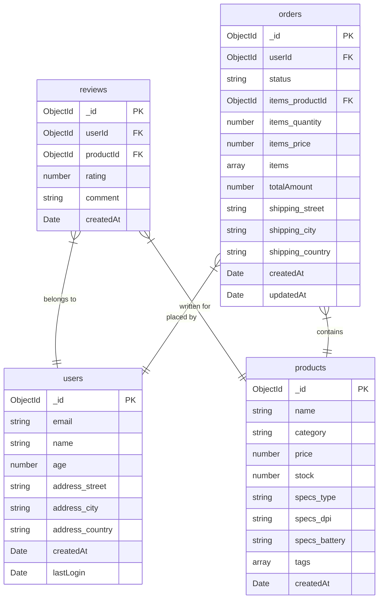

# Shop Database ERD

This is an Entity-Relationship Diagram (ERD) for our online shop database, showing the relationships between users, products, orders, and reviews.

## Schema Description

### Users

- Stores user information including name, email, age, and address
- Tracks user creation and last login dates

### Products

- Contains product details like name, category, price, and stock
- Includes technical specifications and tags
- Tracks when the product was added

### Orders

- Records purchases made by users
- Contains order status and shipping information
- Includes array of ordered items with quantities and prices
- Tracks order creation and update times

### Reviews

- Stores product reviews from users
- Contains rating and comment
- Links to both user and product
- Records when the review was created
